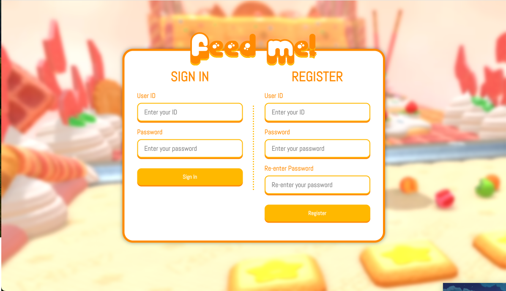

# Feed Me!

'chat_server.js' and files under 'scripts' come from lab 5/6 to be used for reference. 

## Packages

You need to install the following packages to run this project.

    1. bcrypt
    2. ejs
    3. express-session
    4. fs
    5. socket.io
    5. nodemon
    
(Note: Nodemon is only used to help development, it automatically restarts if the server is changed!)

Install them using the `npm i` command (e.g. `npm i bcrypt` if you want to install only bcrypt, just `npm i` to install all packages)

## Running the project

Use the following command to start the webpage on [localhost:3000](localhost:3000)

```
  npm start
```
which automatically runs the following script.
```
  ./node_modules/.bin/nodemon feedme_server.js
```
If you don't want to use nodemon, you can use the standard command.
```
  node feedme_server.js
```

## Where to start?
The game page is located under `views/game.ejs`, which is rendered through

```
app.get('/game', (req, res) => {
    res.render("game");
})
```
in `feedme_server.js`. The lobby code will probably be added to the path (e.g. /game/EGXQ) but idk yet, but you can start writing the html for the gamein that file.

You can access the page on [localhost:3000/game](localhost:3000/game).

## Current progress

Login/SignUp UI



Enter/Create lobby UI


Completed Tasks
1. Login/Signup UI
2. Backend for login/signup
3. User session (websocket)
4. Enter/Create lobby overlay UI
5. Logout(returns to login page)
6. Enter/Create lobby backend


Remaining Tasks(연우)
1. Delete account(?)
2. Game lobby screen
3. Leave game lobby
